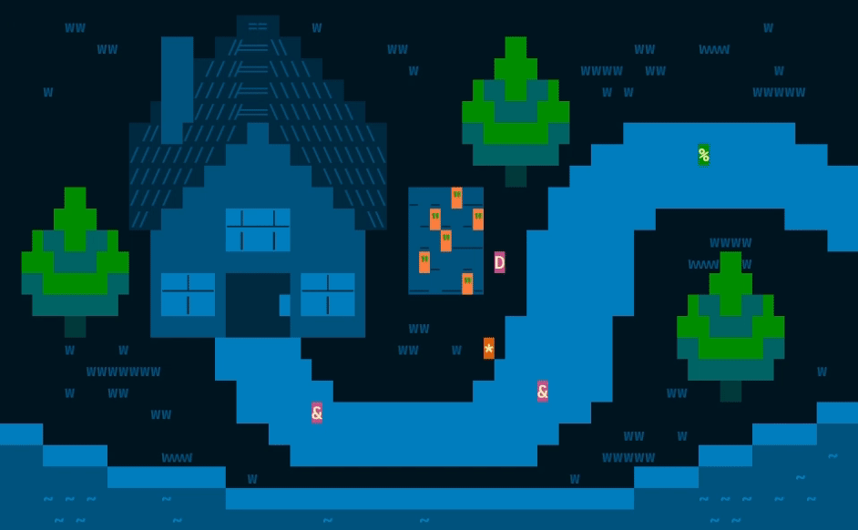
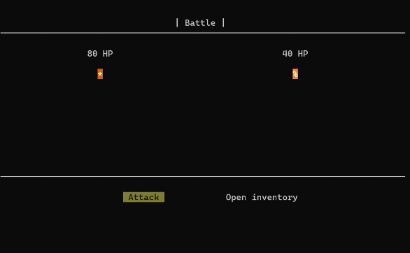
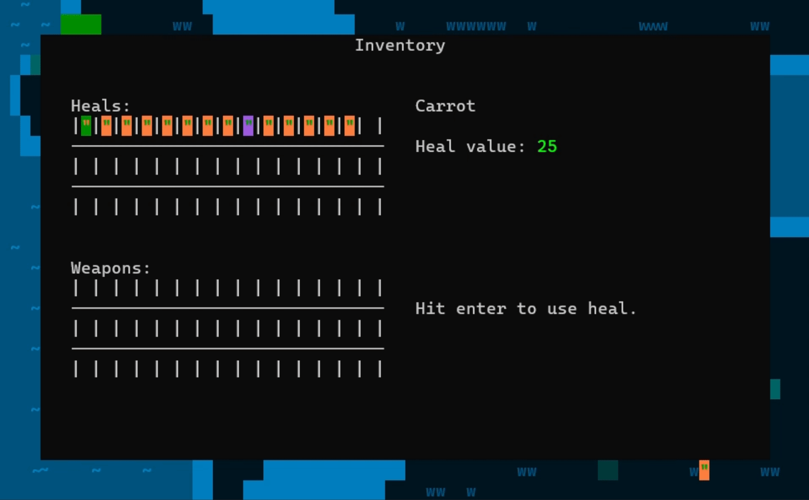
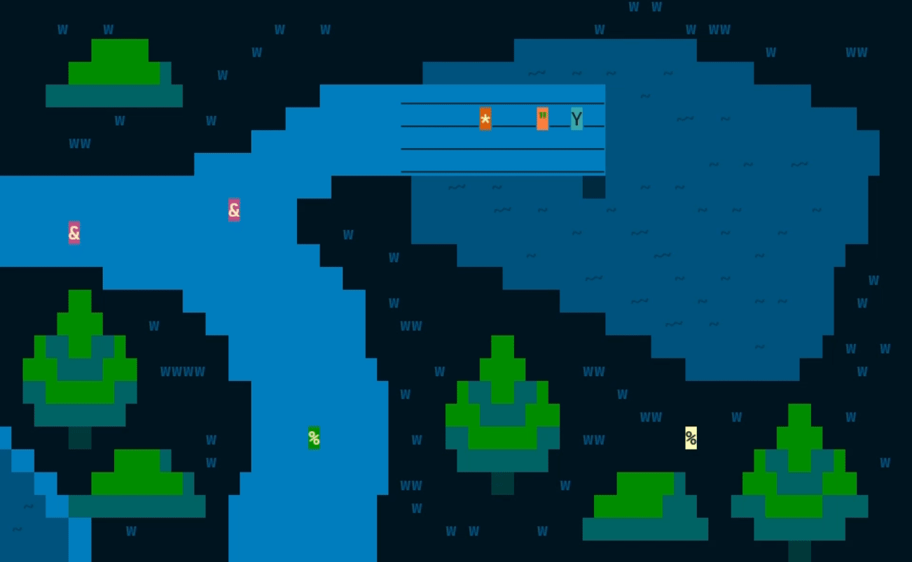
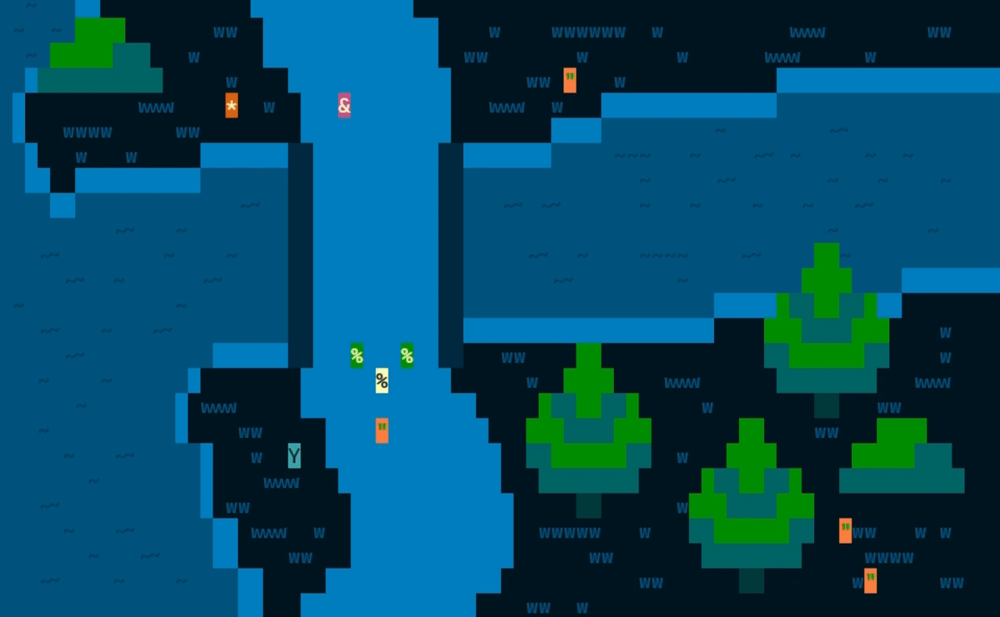

# 🕯️ Luminary

Luminary is a final university team project in the subject "Basics of Objective Oriented 
Programming" made by myself and 3 other classmates:

- [@KrazyManJ](https://github.com/KrazyManJ) - Project management, game functionality
- [@mbbk13](https://github.com/mbbk13) - Game mechanics and logic
- @xplesova *(doesn't have github account)* - Game appearance and maps design
- [@rnbwlex](https://github.com/rnbwlex) - Map design, inventory, main tester 

It is a Console (text-based) RPG game that includes aspects of any kind of a nowadays 
RPG game like inventory management, battles, healing, etc.

This project received evaluation of `15/15`(15 out of 15) points `+2` as bonus for
it's complexity, modularity and over-all playing experience by our exercises teacher.

## 🗣️ Lore

*One day, all around the world, the light faded. Torches that once illuminated 
the entire world went out, extinguished by insectoid creatures that devoured 
all the light until none remained. People feared what would come next and 
whether the light of the world would ever be seen again.*

*But then, one person emerged, Ajekym, who had a rare gift from a young age: 
the ability to see well in the dark. Because his parents primarily grew 
carrots for a living, Ajekym had even healthier and better vision. 
On the day he became an adult, he decided to change the world as we know it. 
He chose to embark on a journey into darkness and relight the torches, 
so he could illuminate the entire world once more.*

*His parents tried to persuade him otherwise, but Ajekym stood firm in 
his decision. So, at least, his father equipped him with the necessary 
gear to better prepare him for the journey.*

*The quest for light begins...*

## 🖼️ Game showcase

    
    <i>Player collecting items</i>

---

    
    <i>Player battling with an enemy</i>

---

    
    <i>Inventory management</i>

---

    
    <i>Lighting torch</i>

---

    
    <i>Dialogue with non-playable character</i>

